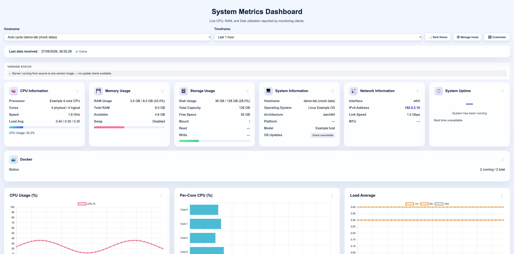

# statix

[](https://hub.docker.com/r/midnightappcoder/statix)
[](https://github.com/chandanankush/statix/actions/workflows/docker-publish.yml)

Monitor your home lab from one self-hosted dashboard. A Python agent collects host metrics on macOS or Raspberry Pi/Linux; a Flask server stores them in SQLite and displays CPU, memory, disk, network, and Docker details.

[Install the server](#1-start-the-server) · [Install an agent](#2-connect-an-agent) · [Questions and feedback](https://github.com/chandanankush/statix/discussions)



*Actual interface, captured from an isolated local server. All host identities and metrics are mock data; this is not a production deployment or performance benchmark.* [Short theme walkthrough](docs/assets/dashboard-demo.gif) (two screenshots, condensed timing).

## What you can do

- Compare CPU, per-core load, memory, disk I/O, and network charts across hosts and timeframes.
- Inspect host details, uptime, active interfaces, and Docker containers when available.
- Switch themes and customize card order, visibility, and visual alert thresholds.
- Configure retention and optional CPU/RAM webhook alerts on the server.

See [dashboard details](docs/dashboard-features.md) for platform-dependent metrics and display options.

## Quick start

Requirements: Docker for the server; Python 3.9+ for agents. The installers target macOS and Debian-based Linux/Raspberry Pi OS. Other environments need their own validation. Review downloaded installer scripts before running them: they create persistent services.

### 1. Start the server

For a local trial, bind the dashboard to your Mac or server's loopback interface:

```sh
docker run -d \
  --name statix \
  --restart unless-stopped \
  -p 127.0.0.1:5050:5000 \
  -v statix_data:/app/data \
  midnightappcoder/statix:latest
```

Open <http://localhost:5050/dashboard>. To receive metrics from other machines, configure an appropriate network binding and access controls first; see [server setup](server/README.md). This local-trial command accepts agents on the same machine only.

For the interactive installer, download and review [server/install.sh](server/install.sh), then run it. [Docker Compose](docker-compose.yml) is also available after cloning this repository.

### 2. Connect an agent

Download and review [client/install.sh](client/install.sh), then run:

```sh
bash client/install.sh --server-url http://127.0.0.1:5050 --interval 30
```

Run this from a cloned repository on the agent host. For a remote agent, replace the URL with your reachable monitoring server. The installer registers a stats service and forwarder; running it again upgrades the installation while retaining configuration.

See the [agent guide](client/README.md) for service management, environment variables, metric payloads, and [uninstallation](client/README.md#uninstall).

### 3. Explore metrics

Choose a hostname and timeframe in the dashboard. Switch to dark mode or customize cards to focus on the information you need. The [server guide](server/README.md) covers the API, data retention, and optional webhook configuration.

## Limitations and security

- This is a self-hosted project; installation, backups, and access control are your responsibility. The repository has no automated test suite; container builds do not prove end-to-end compatibility.
- Dashboard and read APIs are unauthenticated. `STATIX_API_KEY` protects settings writes and host clean/delete operations; **metric ingestion (`POST /metrics`) remains unauthenticated**. Keep the stack on a trusted network or behind separate access controls.
- CPU temperature is platform-dependent and unavailable on Apple Silicon. OS/Docker update checks depend on installed tools and external services.
- Some dashboard preferences are browser-local. Use a persistent server volume to retain metric history across container replacement.

## Support and contribution

Ask setup questions in [Discussions](https://github.com/chandanankush/statix/discussions), or [report a reproducible issue](https://github.com/chandanankush/statix/issues/new/choose) with sanitized data. Start with the [welcome discussion](https://github.com/chandanankush/statix/discussions/10).

Read [CONTRIBUTING.md](CONTRIBUTING.md) before opening a focused PR. Browse [good first issues](https://github.com/chandanankush/statix/labels/good%20first%20issue) and [testing requests](https://github.com/chandanankush/statix/labels/help%20wanted).

Technical references: [architecture](ARCHITECTURE.md), [client](client/README.md), [server](server/README.md), and [deployment](DEPLOYMENT.md). No license file is currently supplied; this documentation does not grant additional reuse rights.
